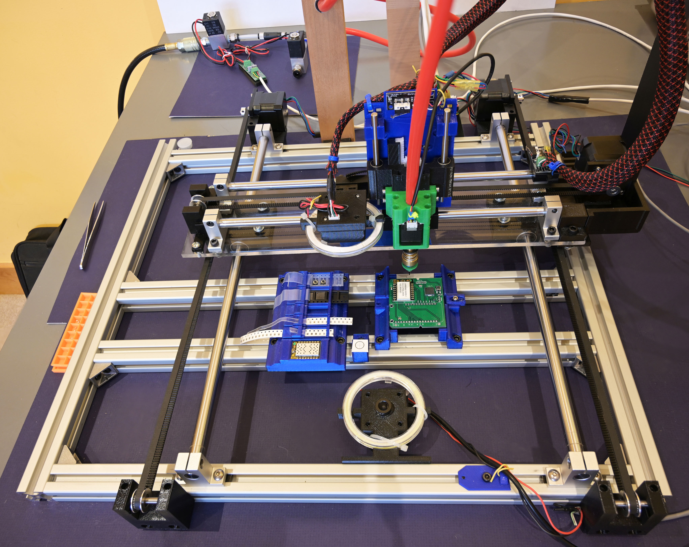
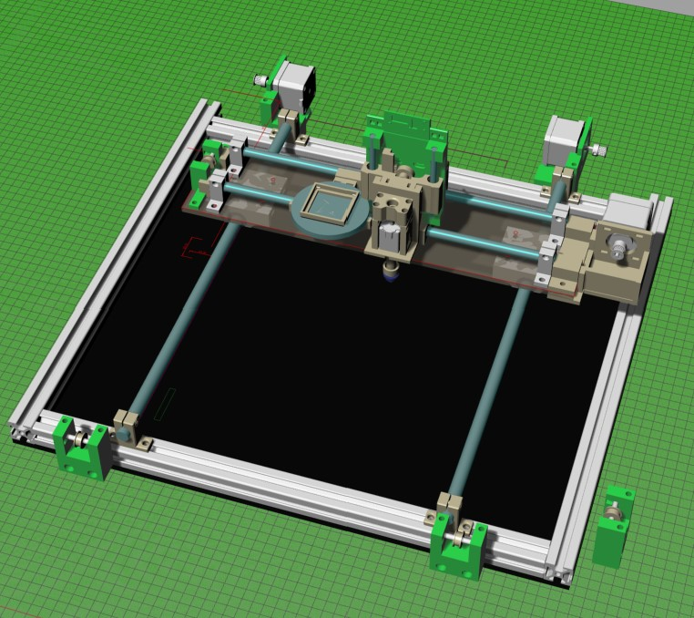
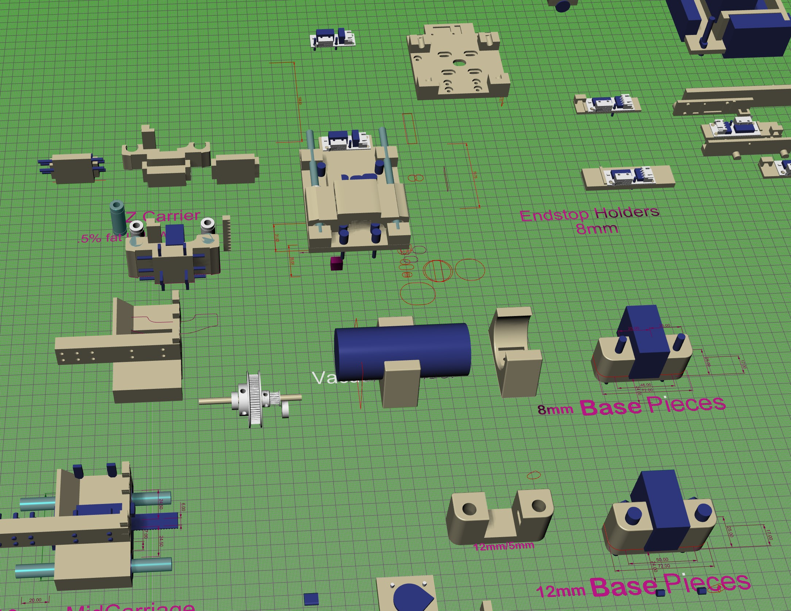

# MZ-PickAndPlace
A mainly 3d printed pick and place machine that easily places 0603s

This is a quick almost silent pick and place machine that can place almost anything. It uses standard juki-style nozzles
and supports a board up to about 10" square (although the pick-place area is smaller depending on camera placement). It has two cameras - one pointing up and one pointing down - and works with OpenPnp.

This is the 6 or 7th iteration of the design. Earlier designs that used 3d printed motion control parts were just too sloppy to be useful
for pick and place and were replaced with off-the-shelf metal brackets. Most of it, though, is 3d printed.

It uses a standard 3d printer controller board to run the motors. All motors and other parts are very standard 3d printed supplies and
hence, compared with industry, dirt-cheap. The only piece I recommend not using stock stuff is the actual linear motion hardware. This I bought
from Misumi and paid maybe 30% more than aliexpress or amazon - but first I tried the off-brand stuff and it was awful.

This is just getting started so there is one Rhino3d file with 
the entire final product on it. The starting file is immense
and has old attempts on it - so for now just this.

## Update: Feb 17, 2021
There has been more interest than I expected in this, so I'm adding the original parts file. It is very large and contains all of the pick and place machine parts in 'prototype' form. That is the part (possibly out of multiple parts, usually grouped) and then the holes - which are done in the Mask (dark blue) layer.

So, to create a 'plastic' (green) part you 
* select the prototype
* copy it
* paste all of it
* union the pasted parts together to get a cohesive part
* subtract out the grouped mask parts to produce the holes

This lets you both adjust the geometry of the part and the negative geometry (holes) of the part.

There is now a Youtube video showing all of the parts and components as the machine was disassembled.[See here](https://youtu.be/ycFrFeo8eH8)

